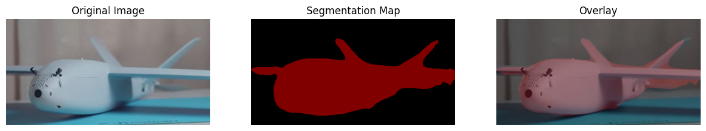
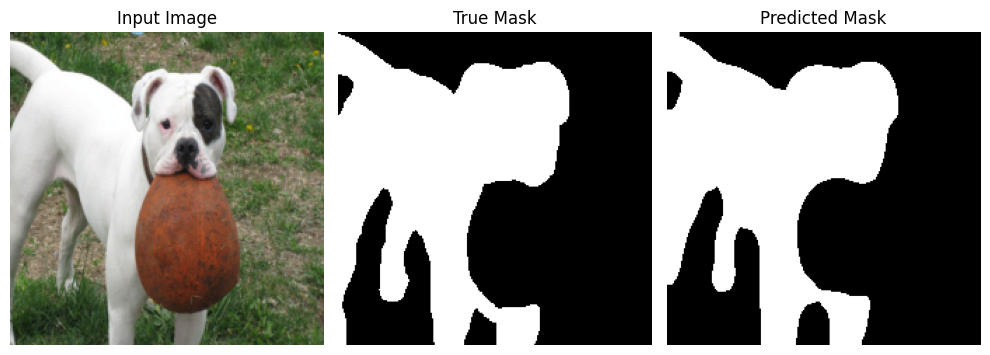
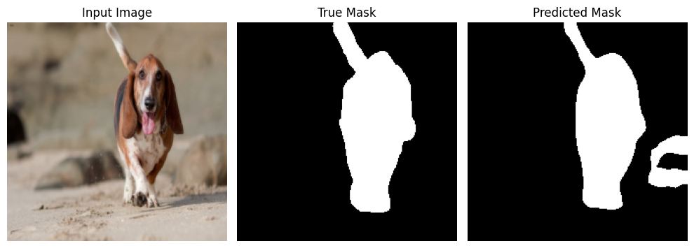
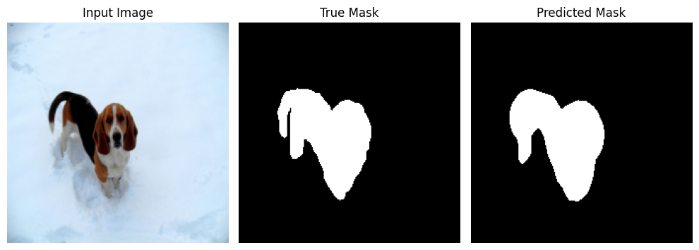
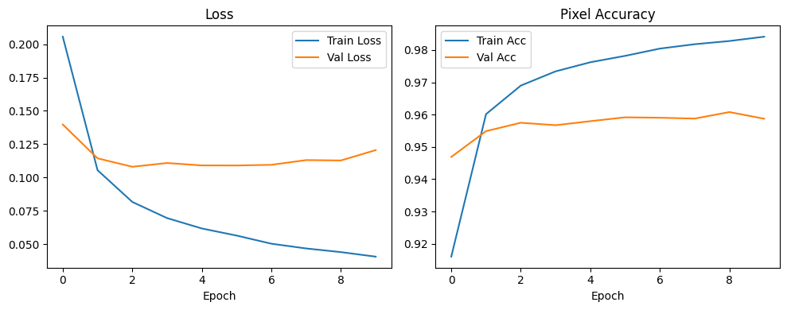
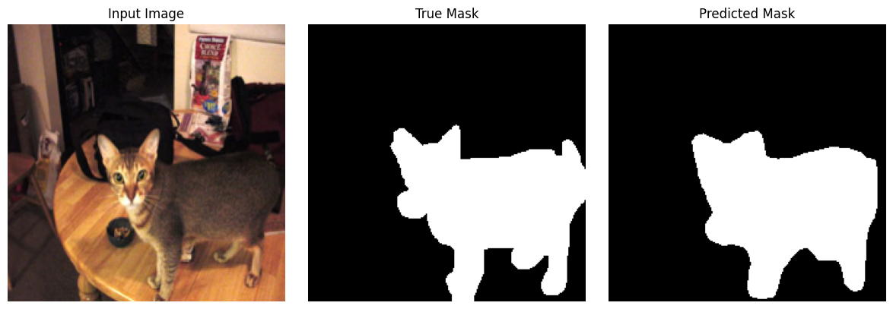

# Tutorial 11 — Semantic Segmentation using Pre-Trained Model

## Overview

This tutorial focused on **semantic segmentation using a pre-trained model**, specifically **DeepLabV3** with a ResNet backbone. 

## Semantic Segmentation Concept

Semantic segmentation assigns a class label to **every pixel** in an image. In the tutorial screenshots, a pre-trained DeepLabV3 model was loaded and used directly on a random image. The output segmentation map was converted into class predictions, then decoded into colors for visualization.

### Tutorial Implementation
This is the simple workflow for semantic segmentation:

1. load model
2. load image
3. preprocess image
4. run inference
5. decode predictions
6. visualize segmentation map

## Task 01 - DeepLabV3 on Oxford-IIIT Pet

The dataset provides segmentation targets, but they are trimaps rather than direct binary masks. For a simpler semantic segmentation pipeline, I converted the trimap into a binary pet-vs-background mask and trained **DeepLabV3-ResNet50** with a new 2-class segmentation head.

The workflow in Cell 2 includes:

* loading the dataset
* resizing and normalizing images
* converting trimaps into binary masks
* creating train / validation / test loaders
* loading a pre-trained DeepLabV3 model
* replacing the classifier head for 2 classes
* training and validating the model
* testing on the held-out split
* visualizing predicted masks
* plotting learning curves

This cell is the practical equivalent of the screenshot pipeline, but on a real dataset instead of a single random image.

  
  
  
  
  
  

## Why Oxford-IIIT Pet Was Appropriate

Oxford-IIIT Pet was appropriate here because:

* it is small and public
* it already has segmentation annotations
* it can be loaded directly through `torchvision`
* it is much easier to use in a notebook than a large industrial dataset

It is therefore suitable for both semantic segmentation and an educational Mask R-CNN demonstration.

## Task 02 -  Mask R-CNN on the Same Dataset

Mask R-CNN is different from DeepLabV3 because it performs **instance segmentation** rather than semantic segmentation. Instead of labeling each pixel only by semantic class, it predicts:

* bounding boxes
* class labels
* instance masks

To use the same Oxford-IIIT Pet dataset for Mask R-CNN, I derived a single foreground object mask and corresponding bounding box from the trimap. That made it possible to train a small instance-segmentation pipeline on the same data source.

The Mask R-CNN cell includes:

* a dataset wrapper that creates instance targets
* bounding-box generation from the segmentation mask
* a custom collate function
* a pre-trained `maskrcnn_resnet50_fpn`
* replacement of box and mask predictors for 2 classes
* short training
* simple validation/test IoU evaluation
* visualization of predicted masks

  
  
  

## Results and Interpretation

The main conceptual result of this tutorial is that the same segmentation-labeled dataset can support two different tasks:

* **semantic segmentation** with DeepLabV3
* **instance segmentation** with Mask R-CNN

DeepLabV3 is more natural when the goal is dense pixel-level labeling, while Mask R-CNN is useful when separate object instances and their masks are needed.

Using Oxford-IIIT Pet also made it easier to understand this distinction because the dataset is small enough for experimentation and its annotations are simple enough to adapt.

## Key Takeaways

* DeepLabV3 can be used directly for semantic segmentation inference
* semantic segmentation and instance segmentation are related but different tasks
* a public dataset like Oxford-IIIT Pet can be adapted for both tasks
* DeepLabV3 is well suited for pixel-wise segmentation maps
* Mask R-CNN is useful when object-level masks and bounding boxes are needed
* preprocessing and target formatting are critical in segmentation tasks
