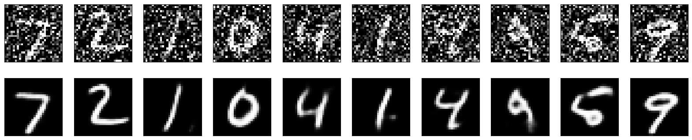
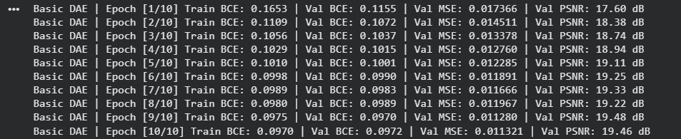
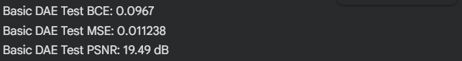
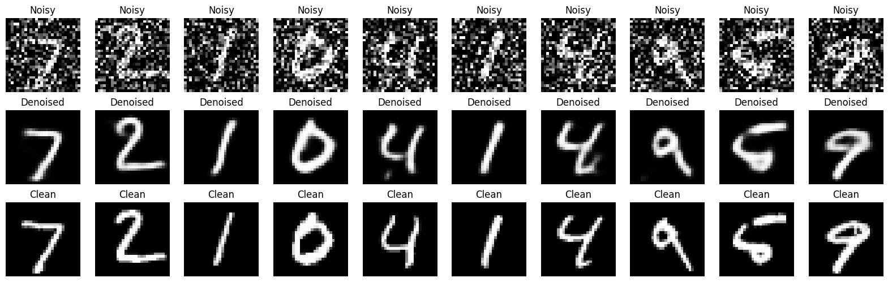
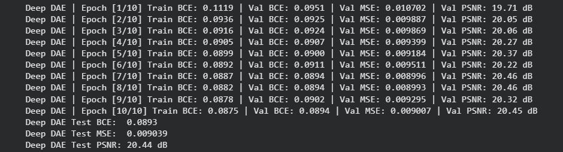
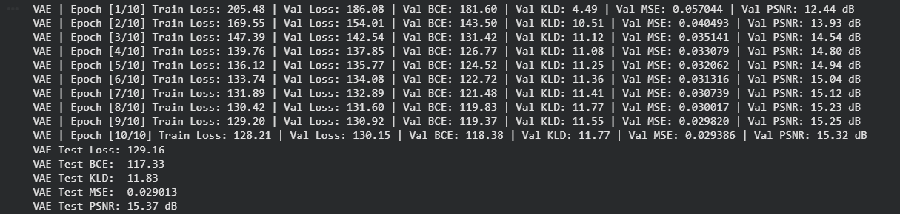
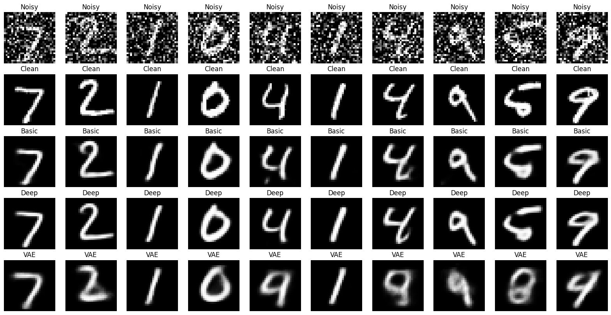

# Tutorial 13 — Denoising Autoencoders

This tutorial focused on **denoising autoencoders** using the MNIST handwritten digit dataset. A denoising autoencoder is trained to take a corrupted or noisy image as input and reconstruct the original clean image as output.

This is different from a basic autoencoder because the input and target are not exactly the same. In a basic autoencoder, the model learns:

```text
clean image → clean image
```

In a denoising autoencoder, the model learns:

```text
noisy image → clean image
```

For the notebook implementation, I kept the TensorFlow code from the tutorial screenshots in one separate cell. Then I implemented the same denoising autoencoder idea in PyTorch. After that, I continued in PyTorch to address the tasks at the end of the PDF:

* implement a deep autoencoder
* implement a variational autoencoder

The notebook was organized into these main parts:

* **Cell 1:** TensorFlow implementation copied from the tutorial screenshots
* **Cell 2 onward:** PyTorch implementation of the denoising autoencoder
* **Task 1:** Deep denoising autoencoder
* **Task 2:** Variational autoencoder
* **Final section:** Evaluation and visual comparison

## What I Learned

From this tutorial, I learned:

* what a **denoising autoencoder** is
* how it differs from a basic autoencoder
* how random noise can be added to clean images
* how a model can learn to reconstruct clean images from noisy inputs
* how convolutional encoder-decoder networks are used for image restoration
* why the training input and training target are different in denoising autoencoders
* how to compare clean, noisy, and reconstructed images visually
* how deeper autoencoders can improve feature learning
* the basic idea behind variational autoencoders

## Denoising Autoencoder Concept

A denoising autoencoder is trained to remove noise from corrupted input data. Instead of simply copying the input to the output, it learns a more useful mapping: how to recover the clean version of an image.

The model has two main parts:

1. **Encoder**

   The encoder receives the noisy image and compresses it into a smaller learned representation. This representation should preserve the useful structure of the digit while ignoring some of the random noise.

2. **Decoder**

   The decoder reconstructs the clean image from the compressed representation. The goal is to produce an output that is close to the original clean image, not the noisy input image.

This makes denoising autoencoders useful for image restoration and representation learning.

## Dataset Used

The tutorial used the **MNIST** dataset. MNIST contains grayscale images of handwritten digits, each with size **28 × 28 pixels**.

The images were normalized to the range **0 to 1**, which is appropriate because the model output uses a sigmoid activation. Since the images are grayscale, each image has one channel.


## Adding Noise to Images

The tutorial adds random Gaussian noise to the MNIST images. This creates corrupted images that are harder to read than the original clean images.

The noise process follows this idea:

```text
noisy_image = clean_image + random_noise
```

After adding noise, the values are clipped so that all pixels remain between 0 and 1. Clipping is important because image pixel values outside this range would not match the normalized MNIST format.

## Cell 1 — TensorFlow Screenshot Code

The TensorFlow denoising autoencoder follows a convolutional encoder-decoder structure.

### Encoder

* a `Conv2D` layer with 32 filters
* a `MaxPooling2D` layer
* a `Conv2D` layer with 64 filters
* another `MaxPooling2D` layer

This reduces the spatial size of the noisy image while increasing the number of feature channels.

### Decoder

* a `Conv2D` layer with 64 filters
* an `UpSampling2D` layer
* a `Conv2D` layer with 32 filters
* another `UpSampling2D` layer
* a final `Conv2D` layer with 1 output channel and sigmoid activation

The output is a reconstructed clean image with the same size as the input image: `28 × 28 × 1`

### Why Binary Cross-Entropy Was Used

This is acceptable because the image values are normalized between 0 and 1 and the output layer uses sigmoid activation. Binary cross-entropy measures how close the reconstructed pixel values are to the clean target pixel values.



## Cell 2 — PyTorch Denoising Autoencoder

The PyTorch model follows the same basic encoder-decoder logic:

```text
noisy image → encoder → compressed representation → decoder → reconstructed clean image
```

The target is the original clean image, not the noisy image and not the digit label.






## Evaluation Metrics

The models were evaluated using reconstruction-based metrics.

| Metric | Meaning                                  | Better Direction |
| ------ | ---------------------------------------- | ---------------- |
| BCE    | Binary cross-entropy reconstruction loss | Lower is better  |
| MSE    | Mean squared pixel error                 | Lower is better  |
| PSNR   | Peak signal-to-noise ratio               | Higher is better |

These metrics help measure whether the reconstructed image is closer to the clean target image. Visual inspection is also important because reconstruction metrics do not always fully describe image quality.

## Visualization of Results

The notebook visualizes the denoising results by comparing:

* noisy input image
* clean target image
* reconstructed output image

This is useful because it directly shows whether the model has learned to remove noise.

A good denoising result should:

* remove random background noise
* preserve the digit shape
* keep strokes clear
* avoid over-smoothing the digit
* reconstruct the clean image more closely than the noisy input

## Task 1 — Deep Autoencoder

The first task at the end of the tutorial was to implement a deep autoencoder.

For this, a deeper PyTorch denoising autoencoder was implemented. Compared with the basic denoising autoencoder, the deep version used more convolutional layers and more feature channels. The purpose of the deep model was to give the network more capacity to learn useful image features and separate digit structure from random noise.

### Deep Denoising Autoencoder Structure

The encoder contains multiple convolutional blocks. Instead of immediately pooling after one convolution, it performs extra convolutional processing before reducing spatial size.

This allows the model to learn better local patterns such as:

* edges
* curves
* digit strokes
* corners
* thickness variations
* local digit structure

The decoder then upsamples the compressed representation back to the original image size.

### Why the Deep Autoencoder Can Be Better

The deep autoencoder can be better because it has more representational capacity than the basic model. The basic model is useful for understanding the concept, but it may produce blurry reconstructions because it has limited feature extraction ability. The deep model can learn more complex mappings from noisy images to clean images. This can help it remove noise while preserving the real structure of the handwritten digit. However, it is not automatically better just because it is deeper.
It should be considered better only if it achieves:

* lower validation or test BCE
* lower test MSE
* higher PSNR
* visually cleaner reconstructions



## Task 2 — Variational Autoencoder

A variational autoencoder is different from a normal autoencoder because it learns a probabilistic latent space. Instead of encoding an image into one fixed latent vector, it learns two vectors:

```text
mean
log variance
```

The model then samples from this latent distribution using the reparameterization trick.

The VAE is trained with two loss components:

1. **Reconstruction loss**

   This measures how close the reconstructed image is to the clean target image.

2. **KL divergence loss**

   This encourages the latent distribution to stay close to a standard normal distribution.

The VAE is useful because it learns a smoother latent space and can also be used for image generation.

### VAE Concept in This Tutorial

The VAE receives noisy images and attempts to reconstruct the clean images. This keeps it connected to the denoising autoencoder topic while also addressing the variational autoencoder task.

The VAE follows this flow:

```text
noisy image
→ encoder
→ mean and log variance
→ sampled latent vector
→ decoder
→ reconstructed clean image
```

This makes it more advanced than the basic denoising autoencoder.



### Basic Denoising Autoencoder vs Deep Autoencoder vs VAE

The three models serve different learning purposes.

| Model                       | Purpose                             | Main Idea                                 |
| --------------------------- | ----------------------------------- | ----------------------------------------- |
| Basic Denoising Autoencoder | Understand denoising reconstruction | Noisy input to clean output               |
| Deep Denoising Autoencoder  | Improve reconstruction quality      | More feature extraction capacity          |
| Variational Autoencoder     | Learn probabilistic latent space    | Reconstruction plus latent regularization |

The basic model is easiest to understand. The deep model is more powerful for reconstruction. The VAE introduces a different type of latent representation.

### Expected Results

The noisy input images should look corrupted because random noise has been added. The basic denoising autoencoder should remove some noise and reconstruct the general digit shape. The deep denoising autoencoder should usually produce cleaner reconstructions than the basic model because it has more convolutional capacity. The VAE may produce smoother reconstructions. Its output can sometimes be slightly blurrier because the latent space is regularized by the KL divergence term.
So the expected qualitative behavior is:

```text
Noisy input: corrupted digit
Basic DAE: cleaner but possibly blurry digit
Deep DAE: cleaner and sharper reconstruction
VAE: smoother reconstruction with structured latent space
```



## How to Decide Which Model Is Better

* lower test BCE
* lower test MSE
* higher test PSNR
* cleaner reconstructed digits
* less remaining background noise
* better preservation of digit strokes

If the deep autoencoder has better metrics and clearer images than the basic denoising autoencoder, then it can be considered an improvement. If the VAE has worse reconstruction metrics but smoother latent behavior, then it should not simply be called better for reconstruction. It should be described as a different autoencoder type with a probabilistic latent space.

## Key Takeaways

* denoising autoencoders learn noisy input to clean output
* the target image should be the clean image, not the noisy image
* adding noise creates a useful reconstruction task
* convolutional autoencoders are suitable for image denoising
* deeper models can improve reconstruction by learning richer features
* VAEs introduce probabilistic latent representations
* VAEs use both reconstruction loss and KL divergence
* train, validation, and test sets must remain separate
* reconstruction quality should be checked using both metrics and images

Overall, this tutorial was useful because it extended the basic autoencoder idea into a more practical problem: recovering clean images from corrupted inputs. It also introduced two important extensions: deeper autoencoders and variational autoencoders.
