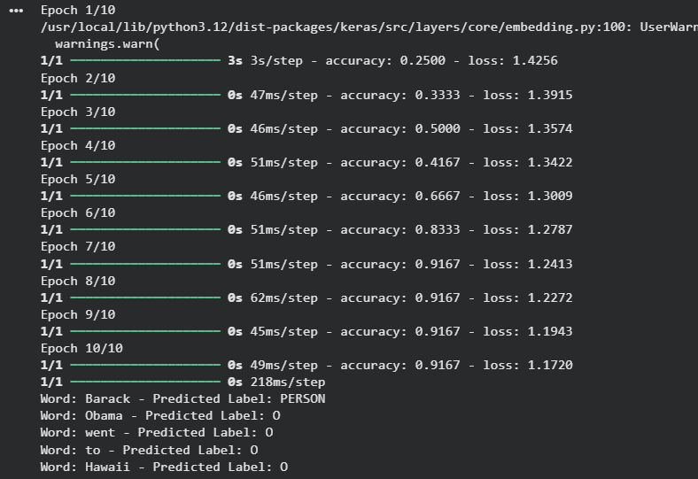
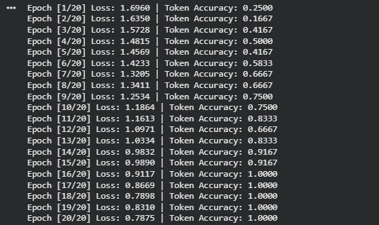
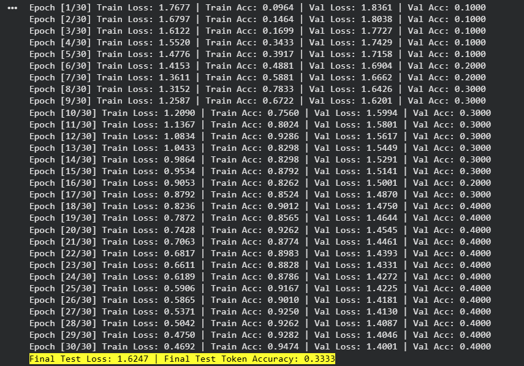
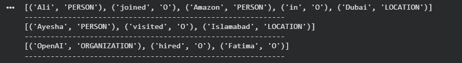
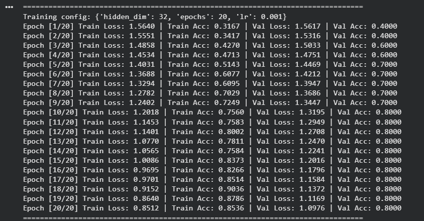
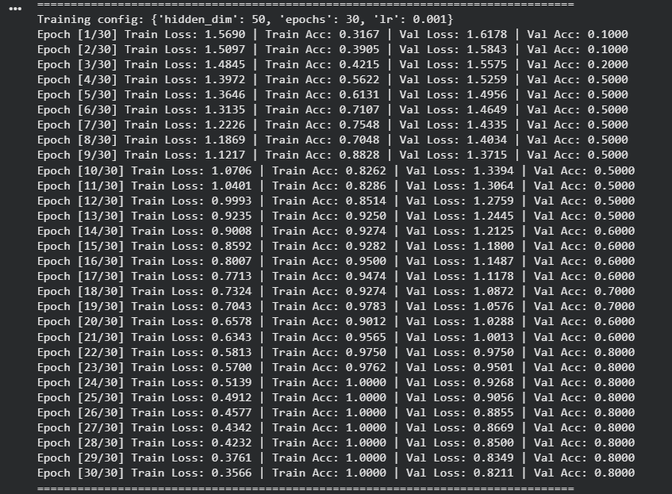
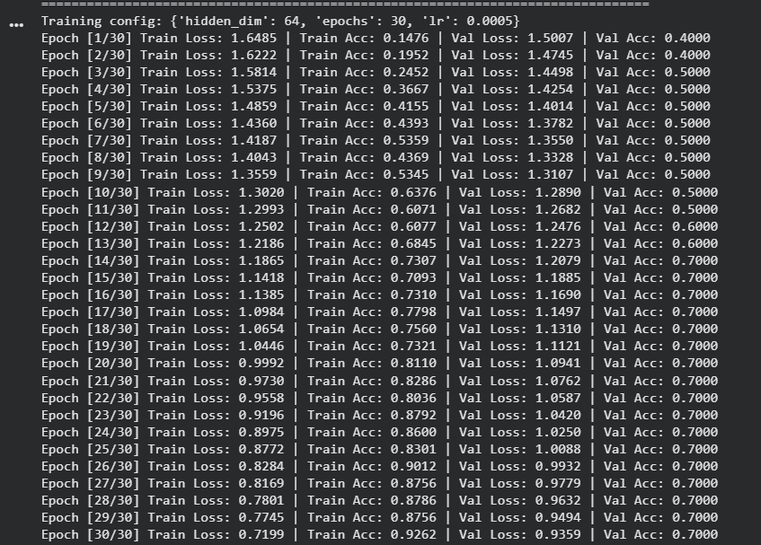
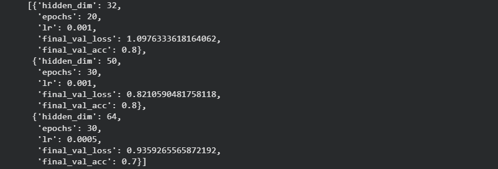
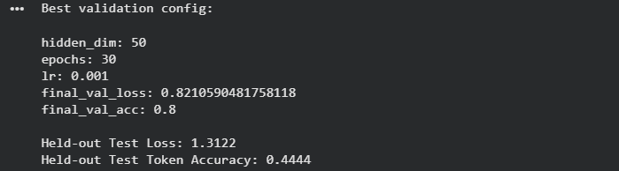

# Tutorial 14_A — Building a Simple RNN for Named Entity Recognition (NER)

This tutorial focused on building a **Simple RNN model for Named Entity Recognition (NER)**. The goal of NER is to assign an entity label to each word in a sentence. 

The notebook implementation was organized into three main parts:

* **Cell 1:** TensorFlow/Keras screenshot code copied from the tutorial PDF
* **Cell 2:** PyTorch implementation of the same Simple RNN NER idea
* **Task section:** custom dataset, model testing, and experiments with units, epochs, and learning rate

## What I Learned

* what **Named Entity Recognition** means
* how NER is a token-level prediction task
* how words can be converted into integer token IDs
* how entity labels can also be converted into integer IDs
* how an RNN processes a sentence sequentially
* why `return_sequences=True` is needed for token-level prediction in Keras
* how to make one prediction for each word in a sentence
* how padding affects sequence models
* why padding should be ignored during loss and accuracy calculation
* how changing RNN units, epochs, and learning rate affects training

## Named Entity Recognition Concept

Named Entity Recognition is a sequence labeling task. Instead of predicting one class for the whole sentence, the model predicts one label for each word.

For example:


`Barack  → PERSON`
`Obama   → PERSON`
`was     → O`
`born    → O`
`in      → O`
`Hawaii  → LOCATION`


This means the input and output are both sequences.

The input sequence is a list of words:

`Barack Obama was born in Hawaii`

The output sequence is a list of labels:

`PERSON PERSON O O O LOCATION`

So the model must preserve the time dimension and produce a prediction at every word position.

## Dataset Used in the Tutorial

The tutorial uses a very small manually created dataset. It contains two example sentences and their corresponding NER labels.

The first sentence is about Barack Obama and Hawaii. The second sentence is about Google and Mountain View.

This dataset is useful for understanding the mechanics of NER, but it is too small for a reliable real-world model. It is mainly for learning how tokenization, label encoding, RNN training, and token-level prediction work.

## Cell 1 — TensorFlow Code

The TensorFlow pipeline follows these steps:

1. create the sentence dataset
2. create the label dataset
3. tokenize the sentences
4. pad the token sequences
5. encode the text labels into integer labels
6. pad the label sequences
7. build a Simple RNN model
8. train the model
9. test it on a new sentence
10. decode predicted labels back into text labels

### TensorFlow Model Structure

The TensorFlow model follows this structure:

```text
Input sentence tokens → Embedding layer → SimpleRNN layer → Dropout layer → TimeDistributed Dense layer → token-level label predictions
```

### TimeDistributed Dense Layer

The `TimeDistributed(Dense(...))` layer applies the same Dense classifier at every time step. This produces one entity-label probability distribution for each word.

### Why Padding Is Needed

Sentences can have different lengths. Neural network batches require tensors of equal length, so shorter sequences are padded. The shorter sentence may be padded to match the longest sentence in the batch. Padding is necessary for batching, but padding tokens are not real words. Therefore, they should not be treated as normal training targets.



## PyTorch Implementation

The model structure is:

```text
word IDs → embedding → RNN → dropout → linear classifier → label logits for each token
```

This converts each RNN hidden state into class scores for the NER labels.




## Task 1 — Make a Custom Dataset and Test the Model on it

A small custom NER dataset was created using names, organizations, and locations.

Example custom sentences included:

```text
Ali works at Google in Lahore
Sara joined Microsoft in Karachi
Ahmed visited Islamabad yesterday
OpenAI is based in San Francisco
Fatima met Bilal in Rawalpindi
```

The same label types were used:

* `PERSON`
* `LOCATION`
* `ORGANIZATION`
* `O`

This keeps the task aligned with the tutorial while making the dataset larger than the original two-sentence example.





## Task 2 — Changing Units, Epochs, and Learning Rate

The second task asked to change:

* number of RNN units
* number of epochs
* learning rate

A small hyperparameter sweep was added to the notebook.

Example configurations were:

| Hidden Units | Epochs | Learning Rate |
| -----------: | -----: | ------------: |
|           32 |     20 |         0.001 |
|           50 |     30 |         0.001 |
|           64 |     30 |        0.0005 |

The purpose of this section was not to find a production-quality model. The purpose was to observe how changing these parameters affects training and validation performance.






| hidden_dim | epochs | lr | final_val_loss | final_val_acc |
|---:|---:|---:|---:|---:|
| 32 | 20 | 0.0010 | 1.097633 | 0.8 |
| 50 | 30 | 0.0010 | 0.821059 | 0.8 |
| 64 | 30 | 0.0005 | 0.935927 | 0.7 |



## Evaluation Metrics

The notebook reports token-level loss and token-level accuracy.

### Loss

The loss is calculated using cross-entropy over the NER labels.

Padding positions are ignored, so the model is not rewarded or punished for predictions on padding tokens.

### Token Accuracy

Token accuracy measures how many real tokens received the correct NER label.

For example, if a sentence has 5 real words and 4 of them are labeled correctly, the token accuracy for that sentence is:

```text
4 / 5 = 0.80
```

Padding positions are excluded from this calculation.

## Why the Model Is Limited

The model in this tutorial is intentionally simple. It is useful for learning, but it has several limitations:

* the dataset is extremely small
* unknown words are mapped to `<UNK>`
* the model does not use pretrained word embeddings
* the model does not use LSTM or GRU gates
* the model does not use transformers
* the model does not understand subword structure
* real NER requires much larger labeled datasets

Because of this, the results should be interpreted as a learning exercise, not as a serious NER benchmark.

## Simple RNN vs Better Sequence Models

A Simple RNN is useful for understanding sequence modeling, but it is not usually the best choice for real NER.

Better options include:

* LSTM
* GRU
* BiLSTM
* BiLSTM-CRF
* transformer models such as BERT


## Key Takeaways

* NER predicts one label per word
* tokenization converts words into integer IDs
* label encoding converts entity labels into integer IDs
* padding is needed for batching variable-length sentences
* padding should be ignored during loss and accuracy calculation
* an embedding layer converts words into dense vectors
* an RNN processes the sentence sequentially
* `return_sequences=True` is needed in Keras for token-level prediction
* `TimeDistributed(Dense(...))` applies classification at every time step
* changing hidden units, epochs, and learning rate can affect model behavior
* a small custom dataset can be used to test the same model pipeline
