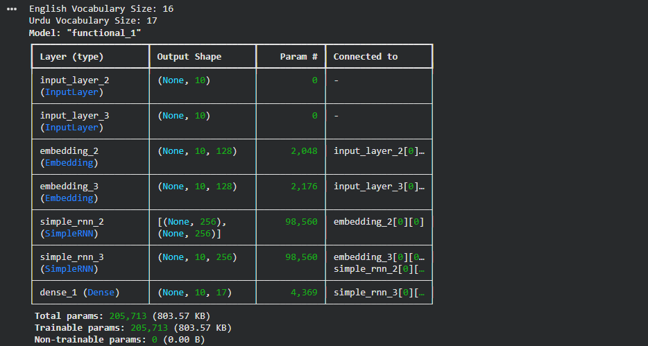
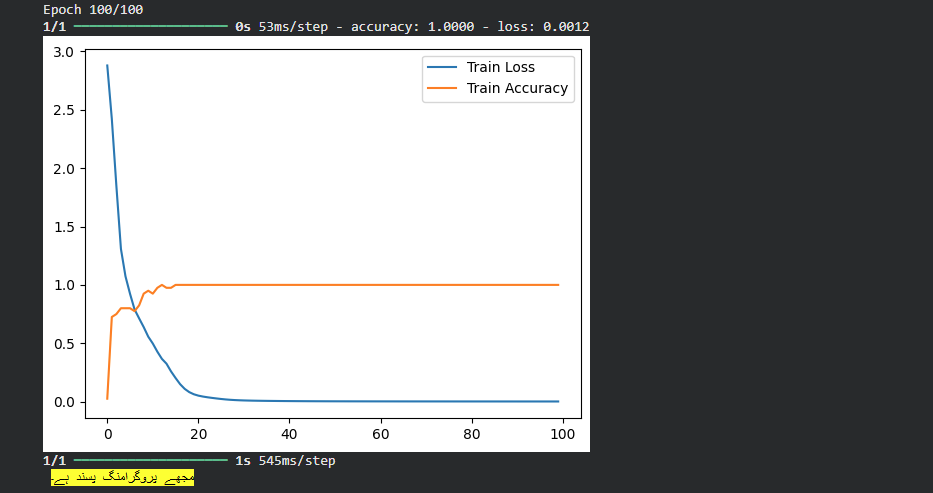
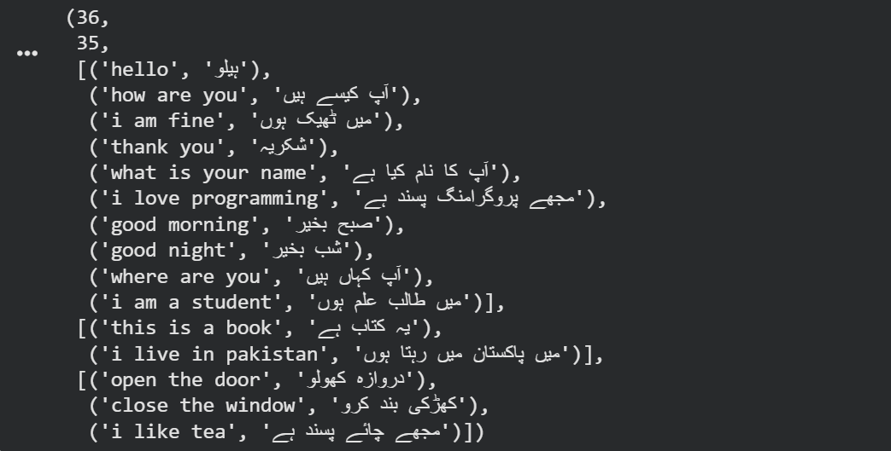
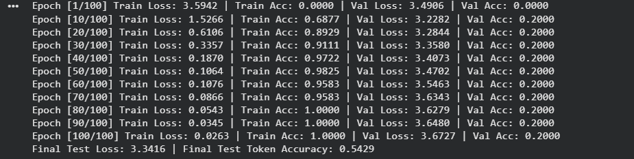
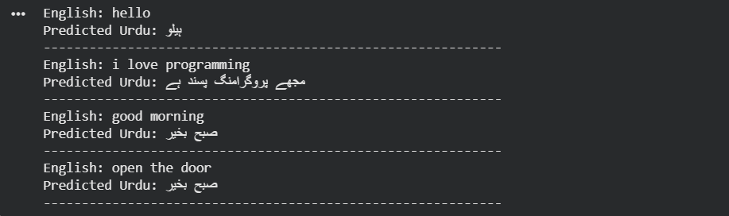
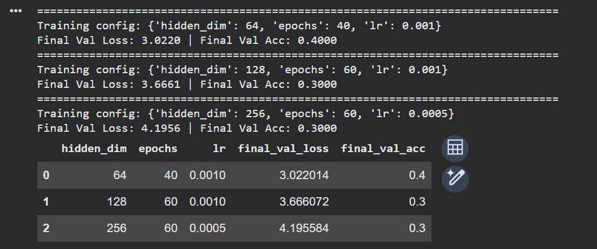
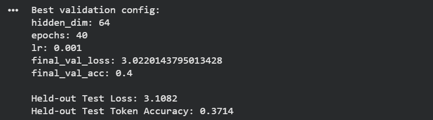
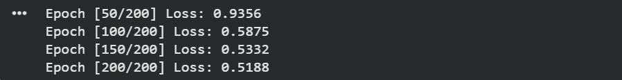
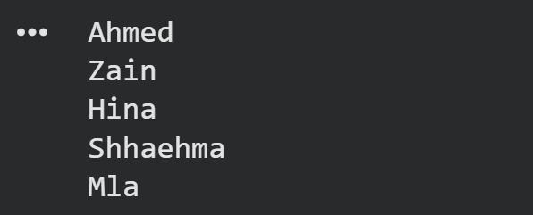

# Tutorial 14_B — English to Urdu Translation Using an RNN

This tutorial focused on **English to Urdu translation using an RNN**. The main idea was to build a small sequence-to-sequence model where an English sentence is given as input and the model generates the corresponding Urdu sentence as output.

The tutorial uses an **encoder-decoder RNN architecture**. The encoder reads the English sentence and compresses it into a hidden representation. The decoder then uses that representation to generate the Urdu translation.

## What I Learned

* how RNNs can be used for sequence-to-sequence learning
* what an encoder-decoder architecture is
* how English and Urdu sentences can be tokenized into integer sequences
* why padding is needed for variable-length sentences
* how decoder inputs and decoder targets are shifted during training
* how teacher forcing works at a basic level
* why padding should be ignored during loss and accuracy calculation
* how changing units, epochs, and learning rate affects training
* how one-to-many RNNs can be used for sequence generation tasks such as baby-name generation

## Translation as a Sequence-to-Sequence Problem

Machine translation is a sequence-to-sequence task. The input is a sequence of English words, and the output is a sequence of Urdu words.

For example:

`English: i love programming`

`Urdu: مجھے پروگرامنگ پسند ہے`

The model must learn a mapping from one sequence to another. This is different from classification because the output is not a single class label. The output is another sequence.

## Why the Urdu Target Is Shifted

In sequence-to-sequence training, the decoder is usually trained to predict the next token.

For example, if the Urdu target is:

***`مجھے پروگرامنگ پسند ہے`***

The decoder receives the previous token and predicts the next token. This is why the target sequence is shifted.

The PyTorch implementation makes this clearer by using:

* `<SOS>` at the beginning of the target sequence
* `<EOS>` at the end of the target sequence

The decoder input is:

`<SOS> مجھے پروگرامنگ پسند`

The decoder target is:

***`مجھے پروگرامنگ پسند ہے <EOS>`***

This keeps the training objective aligned with sequence generation.

## Dataset Used in the Tutorial

The tutorial uses a very small English-Urdu sentence-pair dataset. Example English sentences include:

* `Hello, how are you?`
* `I am fine, thank you`
* `What is your name?`
* `I love programming.`

Each English sentence has a corresponding Urdu translation.

This dataset is useful for understanding the mechanics of translation models, but it is too small for a real translation system. The purpose is educational rather than production-level performance.

## Cell 1 — TensorFlow Code

The TensorFlow pipeline follows these steps:

1. create English and Urdu sentence lists
2. tokenize English sentences
3. tokenize Urdu sentences
4. convert sentences into integer sequences
5. pad sequences to a fixed maximum length
6. build an encoder-decoder RNN model
7. train the model
8. plot training loss and accuracy
9. generate a translation for a new English sentence

### TensorFlow Model Structure

The TensorFlow model follows this structure:

`English input tokens → English embedding → encoder SimpleRNN → hidden state`

Then:

`Urdu decoder input tokens → Urdu embedding → decoder SimpleRNN initialized with encoder state → Dense softmax output`

The encoder processes the English sentence and returns a hidden state. The decoder uses that hidden state as its initial state and predicts Urdu tokens.

### Encoder

The encoder contains:

* an input layer for English token IDs
* an embedding layer
* a SimpleRNN layer with `return_state=True`

The encoder output state represents the English sentence in a compressed form. This state is passed to the decoder.

### Decoder

The decoder contains:

* an input layer for Urdu token IDs
* an embedding layer
* a SimpleRNN layer initialized with the encoder hidden state
* a Dense softmax layer for predicting Urdu vocabulary tokens

The decoder predicts one Urdu token at each time step.

### Generate Translations

After training, the model generates Urdu tokens one by one.

The generation process is:

1. encode the English sentence
2. initialize the decoder with the encoder hidden state
3. start decoding with `<SOS>`
4. predict the next Urdu token
5. feed the predicted token back into the decoder
6. stop when `<EOS>` is predicted or the maximum length is reached

This is the basic inference process for an encoder-decoder translation model.

## PyTorch Implementation

The model structure is:

`English token IDs → EncoderRNN → hidden state → DecoderRNN → Urdu token logits`

The PyTorch encoder contains:

* `nn.Embedding`
* `nn.RNN`

The PyTorch decoder contains:

* `nn.Embedding`
* `nn.RNN`
* `nn.Linear`

The embedding layer converts English word IDs into dense vectors. The RNN processes those vectors sequentially and returns a final hidden state. The decoder receives Urdu input tokens during training and predicts the next Urdu token at each position.

## Task 01 - Make a Custom Dataset and Test It

The first task at the end of the tutorial asked to make a custom dataset and test it with the model.

For this task, a small custom English-Urdu dataset was created. It included simple sentence pairs such as:

* `hello → ہیلو`
* `good morning → صبح بخیر`
* `where are you → آپ کہاں ہیں`
* `i am a student → میں طالب علم ہوں`
* `open the door → دروازہ کھولو`
* `i like tea → مجھے چائے پسند ہے`

The model was tested on held-out examples and additional simple English sentences.

## Task 02 - Changing Units, Epochs, and Learning Rate

The second task asked to change:

* number of RNN units
* number of epochs
* learning rate

A small hyperparameter sweep was added to the notebook.

Example configurations included:

| Hidden Units | Epochs | Learning Rate |
| -----------: | -----: | ------------: |
|           64 |     40 |         0.001 |
|          128 |     60 |         0.001 |
|          256 |     60 |        0.0005 |

The validation set was used to compare these configurations. The best configuration was selected based on validation accuracy and validation loss, then evaluated on the held-out test set.

## Task 3 — One-to-Many RNN for Baby Name Generation

The third task asked to develop a one-to-many RNN model for baby-name generation.A one-to-many RNN generates a sequence from a starting input. In the notebook, this was implemented as a character-level name generator.

The model learns from a small list of names such as:
`Ayan`, `Ali`, `Ahmed`, `Omar`, `Zain`, `Sara`, `Ayesha`, `Fatima`, `Mariam`

The model learns to predict the next character in a name.

### Baby Name Generation Model

The baby-name model uses:

* character vocabulary
* start token
* end token
* embedding layer
* Simple RNN layer
* linear output layer

The training objective is next-character prediction. For example, for the name `Ayan`, the model sees: `<START> A y a n` and learns to predict: `A y a n <END>`. During generation, a starting character is given and the model predicts one character at a time.

### Why This Is One-to-Many

The baby-name model is one-to-many because it starts from a small input, such as a start character, and generates a sequence of output characters.

For example: `A → A y a n`

The input is one starting symbol, but the output is a full name sequence.

## Evaluation Metrics

The notebook reports:

| Metric         | Meaning                                                 |
| -------------- | ------------------------------------------------------- |
| Loss           | Cross-entropy loss over predicted Urdu tokens           |
| Token Accuracy | Fraction of non-padding Urdu tokens predicted correctly |

Padding tokens are ignored in both loss and accuracy.

This is important because otherwise the model could appear better simply by predicting padding tokens correctly.

## Limitations

This tutorial implementation is intentionally simple.

* the translation dataset is very small
* Simple RNNs are weaker than LSTM, GRU, and Transformer models
* there is no attention mechanism
* Urdu tokenization is simplified
* unknown words are mapped to `<UNK>`
* the model may memorize examples instead of learning real translation
* baby-name generation is trained on a very small list of names

Because of this, the notebook should be understood as a learning exercise, not a real translation or name-generation system.

## Simple RNN vs Better Translation Models

Simple RNNs are useful for learning sequence modeling, but they are not the best modern choice for translation.

Better models include:

* LSTM encoder-decoder
* GRU encoder-decoder
* attention-based seq2seq models
* Transformer models

However, the Simple RNN model is appropriate for this tutorial because the objective is to understand the basic architecture.

## Key Takeaways

* translation is a sequence-to-sequence task
* the encoder reads the source sentence
* the decoder generates the target sentence
* source and target vocabularies are separate
* decoder inputs and targets must be shifted
* `<SOS>` and `<EOS>` tokens make sequence generation clearer
* padding must be ignored in loss and accuracy
* validation data should not be used for training
* test data should be kept for final evaluation
* changing hidden units, epochs, and learning rate can affect performance
* one-to-many RNNs can generate sequences such as baby names

Overall, this tutorial was useful because it showed two important RNN applications: English-to-Urdu translation using an encoder-decoder model and baby-name generation using a one-to-many RNN.
