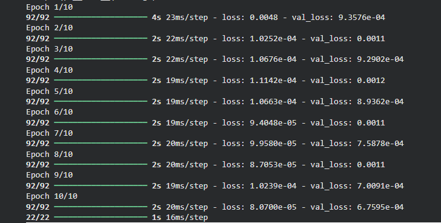
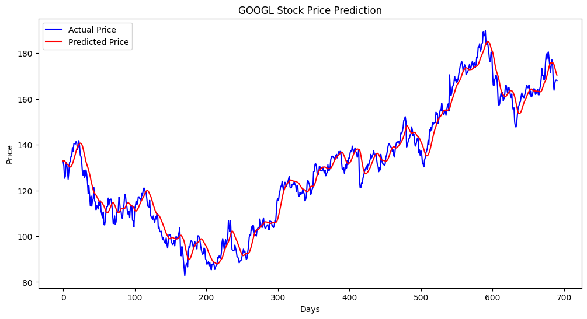
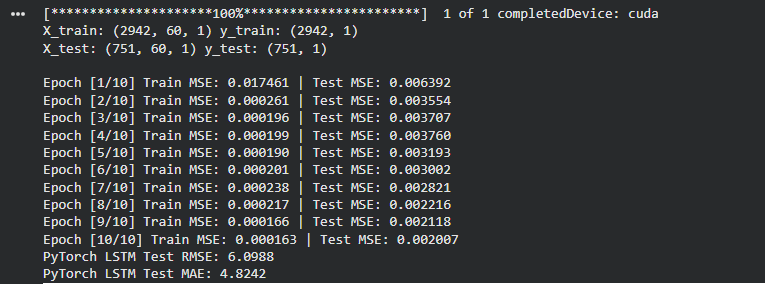
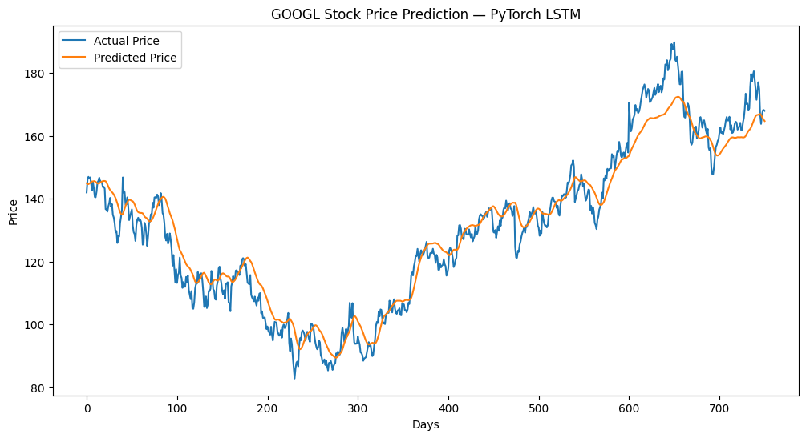
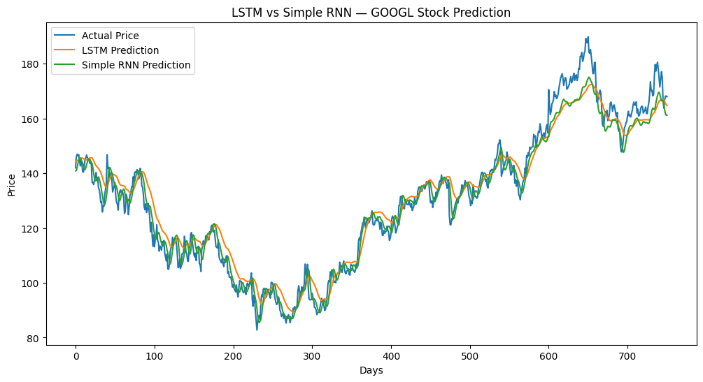
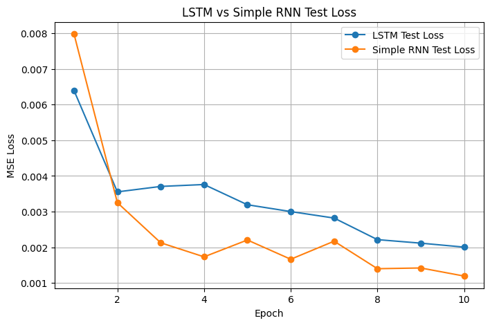
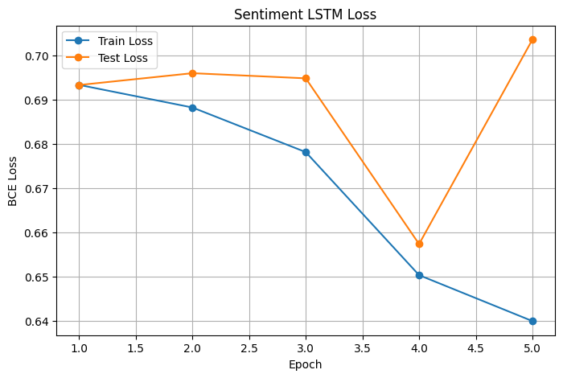
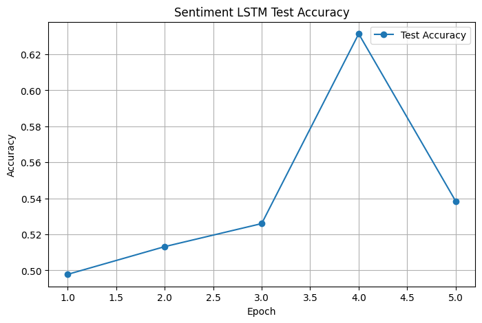

# Tutorial 15 — Long Short-Term Memory (LSTM)

## Overview

This tutorial focused on **Long Short-Term Memory (LSTM)** networks. It demonstrates stock-price sequence prediction using historical `GOOGL` close prices, then extends the tutorial with a Simple RNN comparison and sentiment analysis.

## TensowFlow Implementation

Cell 1 downloads `GOOGL` stock data, creates 60-day sequences, trains a two-layer Keras LSTM model, plots actual vs predicted prices, and predicts the next day's price.

## PyTorch Implementation

Cell 2 implements the same workflow in PyTorch using `nn.LSTM`, `nn.Linear`, MSE loss, and Adam optimizer.

The PyTorch workflow is:

`past 60 close prices → LSTM → predicted next close price`

## Task 1 — Compare LSTM with Simple RNN

Task 1 trains a Simple RNN on the same stock-price sequences used by the LSTM. Both models are compared using RMSE, MAE, and test MSE loss.

  
| Model | RMSE | MAE |
|---|---:|---:|
| LSTM | 6.098768 | 4.824151 |
| Simple RNN | 4.672469 | 3.583108 |

## Task 2 — LSTM for Sentiment Analysis

Task 2 builds a PyTorch LSTM classifier for sentiment analysis using the IMDb review dataset. The dataset is loaded through Keras for convenience, but the model and training loop are PyTorch.

The output is binary sentiment:

* `0` = negative
* `1` = positive

| Epoch | Train Loss | Test Loss | Test Accuracy |
|---:|---:|---:|---:|
| 1 | 0.693276 | 0.693247 | 0.4978 |
| 2 | 0.688172 | 0.695919 | 0.5132 |
| 3 | 0.678105 | 0.694757 | 0.5260 |
| 4 | 0.650332 | 0.657347 | 0.6314 |
| 5 | 0.639960 | 0.703503 | 0.5384 |

## Key Takeaways

* LSTMs can model sequential dependencies
* stock prices can be converted into supervised sequences using sliding windows
* Simple RNN and LSTM can be compared on the same time-series task
* LSTMs can also be applied to text sequences for sentiment analysis
* chronological splitting is important for time-series prediction
* test data should not be used when fitting scalers or training models
