# Tutorial 16 — Generative Adversarial Networks (GANs)

## Overview

This tutorial focused on **Generative Adversarial Networks (GANs)** using the MNIST handwritten digit dataset.
A GAN contains two neural networks:

* **Generator:** takes random noise as input and generates fake images
* **Discriminator:** receives real or fake images and predicts whether they are real

The two networks are trained adversarially. The discriminator learns to distinguish real MNIST images from generated images, while the generator learns to fool the discriminator.


## Dataset

The tutorial uses the **MNIST** dataset. MNIST images are grayscale images of handwritten digits with shape `1 × 28 × 28`. The images are normalized to the range `[-1, 1]` because the generator output uses `Tanh`.


## Tutorial Implementation

The first cell contains the code from the tutorial PDF screenshots.

It includes:

* importing PyTorch libraries
* loading MNIST
* defining the Generator
* defining the Discriminator
* defining BCE loss and Adam optimizers
* training the GAN
* visualizing generated images
  
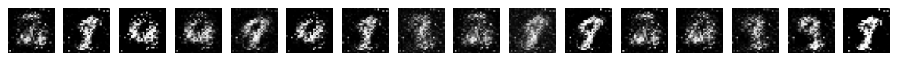
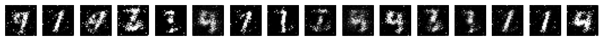
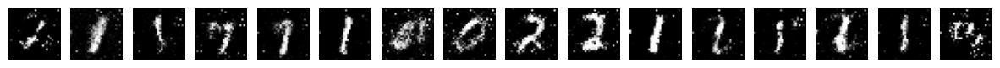
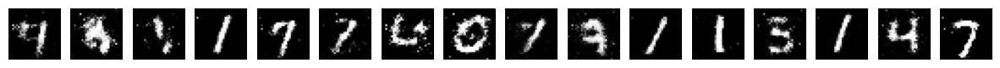

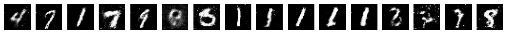


## Task 1 — Change Epochs, Layers, etc.

Task 1 uses a configurable MLP GAN.

The number of layers can be changed by editing:

```python
generator_hidden_dims = (256, 512, 1024)
discriminator_hidden_dims = (1024, 512, 256)
```

The number of epochs can be changed using:

```python
TASK1_EPOCHS = 10
```
<div align="center">

| Epoch | D Loss | G Loss |
|---:|---:|---:|
| 1 | 0.527833 | 1.962618 |
| 2 | 0.353612 | 7.407426 |
| 3 | 0.173426 | 9.518512 |
| 4 | 0.612551 | 5.515673 |
| 5 | 0.217423 | 8.909082 |
| 6 | 0.177561 | 8.749610 |
| 7 | 0.553509 | 8.486512 |
| 8 | 1.326552 | 8.412193 |
| 9 | 0.726846 | 5.587872 |
| 10 | 1.427726 | 3.906267 |

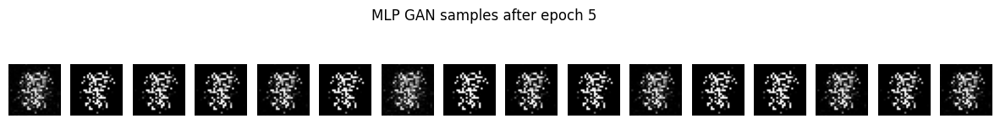
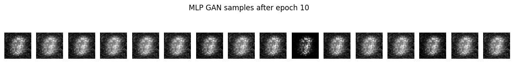
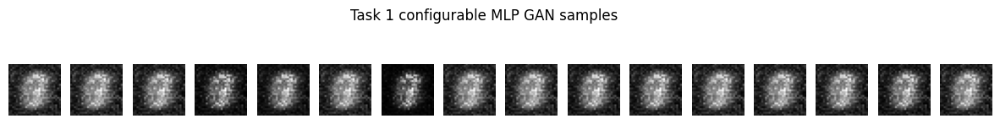

</div>

This satisfies the task of changing epochs, layers, and related settings.

## Task 2 — Replace Fully Connected Layers with Convolutional Layers

Task 2 implements a DCGAN-style model.

The generator uses:

* `ConvTranspose2d`
* `BatchNorm2d`
* `ReLU`
* `Tanh`

The discriminator uses:

* `Conv2d`
* `BatchNorm2d`
* `LeakyReLU`
* `Sigmoid`

<div align="center">

| Epoch | D Loss | G Loss |
|---:|---:|---:|
| 1 | 0.131226 | 5.019188 |
| 2 | 0.006217 | 6.931746 |
| 3 | 0.013622 | 6.835582 |
| 4 | 0.014951 | 6.768475 |
| 5 | 0.005059 | 7.585613 |
| 6 | 0.001145 | 8.030441 |
| 7 | 0.000754 | 8.275624 |
| 8 | 0.000477 | 8.560059 |
| 9 | 0.000311 | 8.949617 |
| 10 | 0.000303 | 8.903383 |

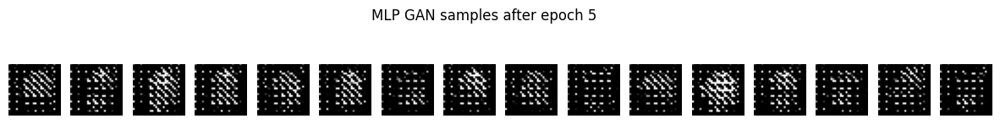
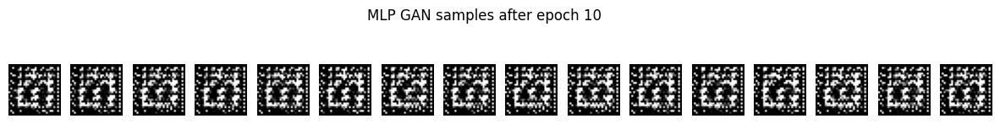
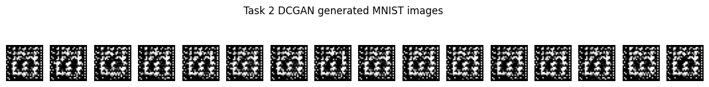

</div>

This replaces the fully connected image-generation architecture with a convolutional architecture.

## Task 3 — GAN for Augmented Images

Task 3 trains a DCGAN-style model on augmented MNIST images.

The augmentation includes:

* random rotation
* random translation
* random scaling

<div align="center">

| Epoch | D Loss | G Loss |
|---:|---:|---:|
| 1 | 0.078338 | 5.497996 |
| 2 | 0.031233 | 5.868295 |
| 3 | 0.016406 | 7.229493 |
| 4 | 0.006460 | 7.648999 |
| 5 | 0.001364 | 7.912468 |
| 6 | 0.006136 | 6.947454 |
| 7 | 0.007189 | 7.379180 |
| 8 | 0.051445 | 5.173863 |
| 9 | 0.121330 | 4.272436 |
| 10 | 0.159736 | 3.684620 |

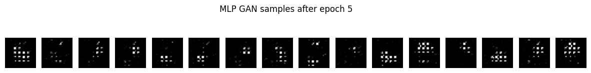
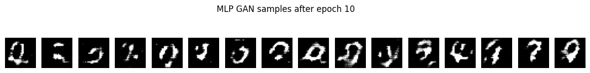
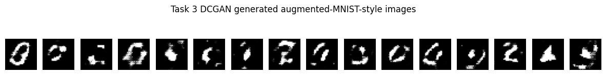

</div>

This addresses the task of developing the model for augmented images.

The augmented dataset still uses only the MNIST training split, so no test images are mixed into training.

## Final Comparision

<div align="center">
  
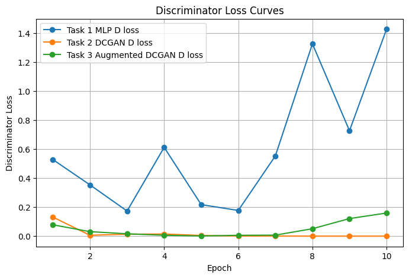
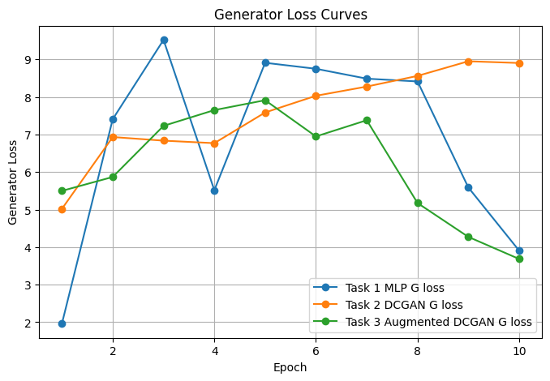

</div>

## Important Notes

GAN losses are not interpreted the same way as ordinary supervised learning losses.

A lower generator loss does not always mean better images. A lower discriminator loss can sometimes mean the discriminator is overpowering the generator.

Therefore, generated image samples should always be inspected together with the loss curves.

## Key Takeaways

* GANs contain a generator and a discriminator
* the generator learns to create fake images from random noise
* the discriminator learns to classify real versus fake images
* fully connected GANs can generate MNIST-like images
* convolutional GANs are more suitable for image generation
* data augmentation can change the target image distribution learned by the GAN
* GAN training is unstable and should be judged using both losses and image samples
